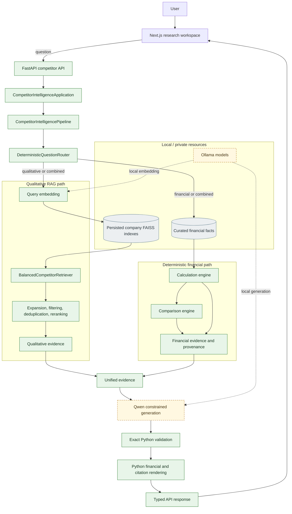

# Local Competitor Intelligence RAG

A local-first competitor-intelligence system for researching ASUS, Gigabyte, and MSI. It combines balanced multi-company retrieval, deterministic financial analysis, grounded local LLM synthesis, structured provenance, a FastAPI service, and a Next.js research workspace. The project is an engineering prototype: it demonstrates authority boundaries and traceable evidence, not production security or unrestricted financial analysis.

<!-- Privacy-safe showcase image planned: docs/assets/showcase-overview.png -->

## What This Project Does

The application accepts natural-language competitor questions and routes them through the evidence paths the question actually requires:

- **Qualitative research** retrieves annual-report evidence independently for each requested company.
- **Financial analysis** calculates a bounded set of metrics from curated, validated facts using deterministic Python code.
- **Combined analysis** joins qualitative evidence and financial provenance before grounded synthesis.
- **Structured citations** carry company, year, source title, page, document type, metric, and evidence identity where those fields are available.
- **Local generation** uses Ollama for the competitor workflow; the browser communicates with a local FastAPI service.

The resulting answer, validated financial claims, domain status, and citations are presented in a responsive Next.js research workspace.

## Why This Architecture

Free-form generation should not be the authority for financial calculations, rankings, evidence identity, or provenance. This project separates language generation from deterministic application authority:

- The LLM writes qualitative prose over a supplied evidence scope and selects from explicitly authorized financial claim records.
- Python routes the question, retrieves and labels evidence, performs all financial arithmetic, validates every generated financial claim, renders financial statements, and constructs citations.

In short: the model handles constrained language tasks; application code owns trusted facts and calculations.

## Key Capabilities

- Deterministic routing across qualitative, financial, and combined questions
- Separate persisted FAISS indexes and balanced Top-K retrieval per company
- Controlled query expansion, evidence-quality filtering, overlap suppression, and lightweight semantic reranking
- Page-aware PDF ingestion with stable company/source/page/chunk identities
- Local Ollama embeddings with bounded batch requests
- Decimal-based margin, growth, ranking, and year-change calculations
- Unified qualitative and financial evidence models
- Split qualitative-prose and financial-claim generation contracts
- Exact financial claim-to-evidence validation and Python-owned rendering
- Structured citation and provenance responses through FastAPI
- Presentation-only financial rendering in the Next.js frontend
- Privacy-safe session history containing only question, timestamp, and status

## System Architecture



Green nodes represent deterministic application authority, dashed amber nodes identify model responsibilities, and gray nodes represent local resources. Private documents, financial facts, and indexes stay outside the public repository.

## Deterministic Authority vs LLM Responsibility

| Deterministic Python/application authority | Local LLM responsibility |
|---|---|
| Question routing and supported-intent detection | Qualitative prose over the supplied evidence scope |
| Company, year, metric, and operation selection | Structured selection from authorized financial claims |
| Evidence IDs and company-balanced retrieval | No independent fact, rank, or citation creation |
| Evidence filtering, deduplication, and reranking | |
| Financial facts and Decimal calculations | |
| Rankings, ties, and percentage-point changes | |
| Exact financial claim validation | |
| Financial sentence rendering | |
| Citation construction and domain statuses | |

**The LLM does not calculate financial metrics or determine trusted financial values.** Generated financial claims are accepted only when their evidence ID, type, role, value, company, and rank exactly match an authorized claim record.

Qualitative provenance is currently **scope-level rather than sentence-level**. The selected qualitative evidence set authorizes the generated narrative as a whole; the system does not claim sentence-level entailment.

## End-to-End Request Flows

### Qualitative question

> Compare ASUS and Gigabyte's AI strategies.

The deterministic router selects the qualitative route. Each company index is searched independently, candidate evidence is filtered and reranked, and Qwen produces prose from only the selected evidence scope. Python assigns and returns the structured source provenance.

### Financial question

> Compare ASUS and MSI's 2025 gross margins.

The router identifies the companies, year, metric, and comparison operation. Python loads the required curated facts, calculates each margin with `Decimal`, ranks the validated results, and creates authorized claim records. Qwen may select those records, but Python verifies and renders the final financial statements.

### Combined question

> Compare ASUS and Gigabyte's AI strategies and 2025 gross margins.

Both evidence paths run. Qualitative annual-report evidence and deterministic financial evidence enter one unified evidence set. Split generation produces qualitative prose and authorized financial claims; application validation and rendering produce the final answer and citations.

No real financial answer is stored in this public README.

## Grounding and Provenance

Every request receives deterministic, request-local unified evidence IDs. Evidence may represent:

- A selected annual-report chunk with company, year, document, PDF page, source identity, and chunk identity
- A reported financial fact with source provenance
- A Python-calculated metric with formula and input facts
- A cross-company ranking with the requested-company set and ranked calculation results
- A same-company year change with earlier/later calculation provenance

The API returns citations as structured objects rather than asking the frontend to parse citation syntax from prose. The evidence panel preserves source order and presents only safe response fields. Financial provenance is claim-level; qualitative provenance is scope-level.

## Financial Authority Model

Financial handling is deliberately separated from narrative generation:

1. Curated trusted facts are loaded and validated from a local CSV resource.
2. Unit normalization and calculations use Python `Decimal`, never binary floating point.
3. Calculation results retain formula and source-fact provenance.
4. Comparison results deterministically own ordering, ties, missing-company handling, and direction.
5. The model receives a closed list of authorized string-valued claims.
6. Python rejects any changed or invented value, role, rank, company, or evidence ID.
7. Python renders the validated financial text and citations.

The current calculated metric vocabulary includes gross margin, operating margin, net margin, revenue year-over-year growth, and percentage-point margin changes. Facts are curated; the application does **not** automatically extract financial values from PDFs.

## Tech Stack

| Area | Technologies |
|---|---|
| Frontend | Next.js 16, React 19, TypeScript, Tailwind CSS, Lucide React |
| Backend/API | Python 3.10+, FastAPI, Pydantic, Uvicorn |
| Retrieval | FAISS `IndexFlatL2`, NumPy, persisted per-company indexes, deterministic retrieval controls |
| Local AI | Ollama, `nomic-embed-text`, configurable local Qwen generation model |
| Financial analysis | Python `Decimal`, deterministic calculation and comparison engines |
| Document processing | pypdf, AES-compatible PDF handling, structure-aware chunking |
| Quality | Pytest, ESLint, TypeScript compiler, Next.js production build |

Google Gen AI remains available to the reusable generic RAG foundation, but the composed competitor-intelligence application requires local Ollama providers.

## Repository Structure

```text
enterprise-rag-prototype/
├── src/enterprise_rag/
│   ├── competitor_api.py                 # FastAPI boundary
│   ├── competitor_application.py         # Production composition
│   ├── competitor_orchestration.py       # End-to-end competitor pipeline
│   ├── competitor_planning.py            # Deterministic routing
│   ├── competitor_retrieval.py           # Balanced company retrieval
│   ├── competitor_evidence.py            # Unified evidence model
│   ├── competitor_grounded_synthesis.py  # Split constrained synthesis
│   ├── competitor_citations.py           # Citation/provenance rendering
│   ├── financial_*.py                    # Facts, calculations, comparisons
│   ├── pdf_loader.py                     # Page-aware PDF ingestion
│   └── vector_store.py                   # FAISS persistence
├── frontend/                             # Next.js research workspace
├── scripts/                              # Import, cleaning, PDF preflight
├── tests/                                # Offline unit/integration tests
├── data/                                 # Public placeholders; private data ignored
└── notebooks/                            # Historical Colab prototype
```

Private source documents, financial facts, manifests, extracted corpora, and generated indexes are intentionally absent.

## Local Setup and Runbook

### Prerequisites

- Python 3.10 or newer
- Node.js and npm
- Ollama running on a trusted local or organization-controlled host
- `nomic-embed-text` and a configured local generation model such as `qwen3:8b`
- For the full competitor demo: compatible local per-company indexes and curated financial facts that are not included in Git

The repository code and automated test suite can be inspected and run without the private competitor resources. Full application composition requires those local resources.

### 1. Install the Python project

```powershell
python -m venv .venv
.\.venv\Scripts\Activate.ps1
python -m pip install -r requirements.txt
Copy-Item .env.example .env
```

`pyproject.toml` is the dependency source of truth. `requirements.txt` installs the editable project and test extras.

### 2. Configure the local providers

Review `.env` and keep the competitor providers local:

```dotenv
EMBEDDING_PROVIDER=ollama
GENERATION_PROVIDER=ollama
OLLAMA_BASE_URL=http://localhost:11434
OLLAMA_EMBEDDING_MODEL=nomic-embed-text
OLLAMA_CHAT_MODEL=qwen3:8b
```

Never commit `.env`. Confirm required models with `ollama list`; model installation and service lifecycle are managed outside this project.

### 3. Supply local application resources

The composed competitor backend validates that all required company indexes and the configured financial-facts resource are available. These resources are private/local prerequisites and are not downloaded or generated automatically at API startup.

### 4. Start the local API

```powershell
.\.venv\Scripts\python.exe -m uvicorn enterprise_rag.competitor_api:app `
  --host 127.0.0.1 `
  --port 8765
```

Verify readiness in another terminal:

```powershell
Invoke-RestMethod http://127.0.0.1:8765/ready
```

`/health` confirms that the HTTP process is alive. `/ready` additionally confirms that the composed local competitor application is available.

### 5. Start the frontend

```powershell
Set-Location frontend
npm ci
Copy-Item .env.example .env.local
npm run dev
```

Open <http://localhost:3000>. The browser calls the configured local API URL; the backend CORS allowlist must include the frontend origin.

## Example Research Questions

- Compare ASUS and Gigabyte's AI strategies.
- Compare ASUS and MSI's 2025 gross margins.
- Compare ASUS and Gigabyte's AI strategies and 2025 gross margins.
- How did Gigabyte's operating margin change from 2024 to 2025?
- Compare AI server positioning across ASUS, Gigabyte, and MSI.

These question texts are safe to publish; this README intentionally contains no private answers.

## Testing and Validation

Current verified quality gates:

- **779 backend tests passed**
- **Frontend ESLint passed**
- **TypeScript validation passed**
- **Next.js production build passed**
- Real local Ollama indexing, retrieval, generation, API, and browser flows have been validated separately

Run the offline backend suite:

```powershell
.\.venv\Scripts\python.exe -m pytest `
  --basetemp=C:\tmp\enterprise-rag-tests `
  -p no:cacheprovider `
  -ra
```

Run frontend quality checks:

```powershell
Set-Location frontend
npm run lint
npm run typecheck
npm run build
```

Automated provider tests use fakes or mock transports. They do not require Gemini, Ollama, localhost, or external network calls.

## Privacy Model

The public repository excludes:

- Environment secrets and API credentials
- Private source documents and extracted text
- Curated private financial facts
- Persisted FAISS indexes
- Source manifests and hashes
- Raw prompts, provider responses, and local smoke artifacts

These categories are protected by Git ignore rules. The local competitor composition requires Ollama; privacy still depends on `OLLAMA_BASE_URL` pointing to a trusted local or organization-controlled service. Optional Gemini support in the generic foundation sends relevant content to an external service and must follow the applicable data-handling policy.

Portfolio screenshots must use clearly identified synthetic demonstration data. Real private financial values, report excerpts, source titles, paths, and URLs must not appear in committed assets.

## Known Limitations

- Qualitative provenance is scope-level and does not prove sentence-level entailment.
- Generated prose remains dependent on retrieval quality and the supplied evidence scope.
- Supported companies, fiscal years, intents, and financial metrics are deliberately bounded.
- The full local demo requires private resources that are not distributed in this repository.
- Financial facts are curated rather than automatically extracted from source PDFs.
- There is no real-time news or competitor-data ingestion.
- There is no OCR pipeline.
- There is no authentication, deployment, multi-user data layer, or production access-control system.
- Generation is non-streaming and requests are retried only through explicit user action.
- This is an engineering prototype, not a production decision system.

## Future Work

- Sentence-level qualitative evidence binding
- A public synthetic demo dataset and reproducible showcase package
- Broader, carefully governed financial metric support
- A richer evidence viewer
- Controlled current-news ingestion
- Authentication and deployment hardening

## Reusable RAG Foundation

The competitor application is built on reusable document loading, structure-aware chunking, provider abstractions, FAISS persistence, retrieval, and generic RAG pipeline modules. Gemini remains an optional provider for that generic foundation. The original Colab notebook is preserved only as historical reference; modular code under `src/enterprise_rag/` is the source of truth.
